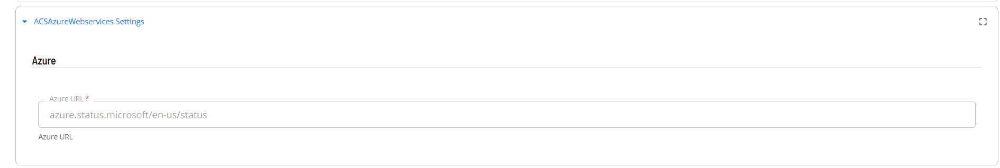
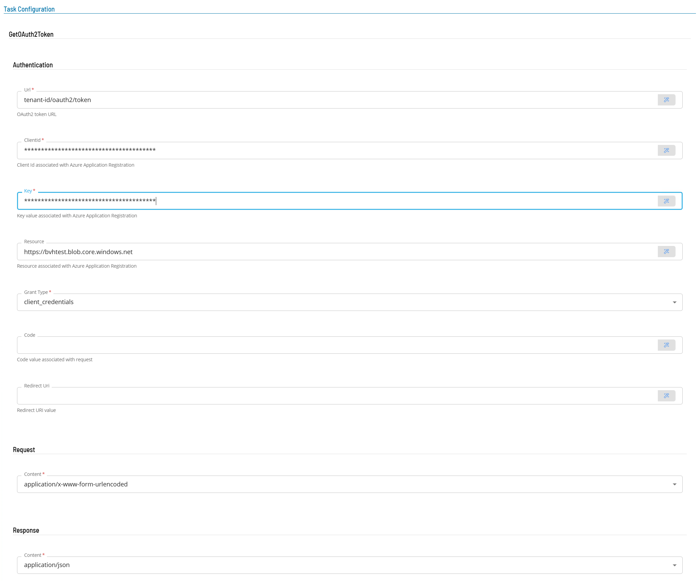
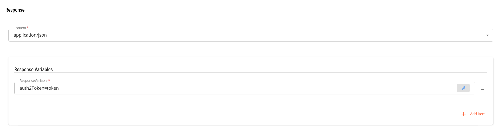
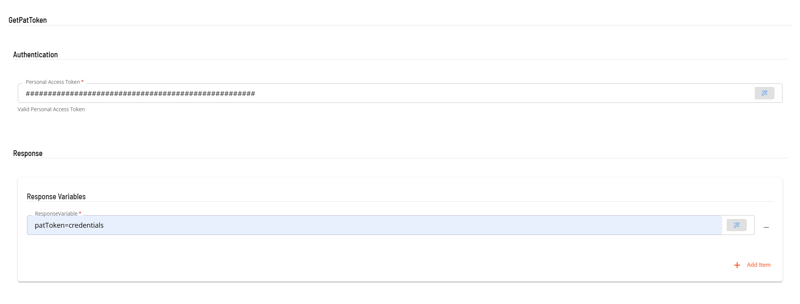
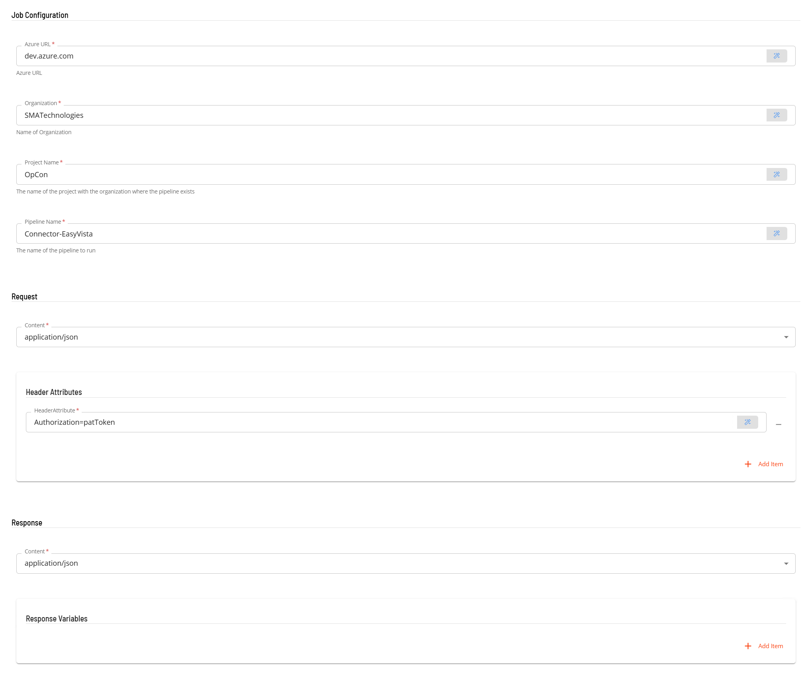
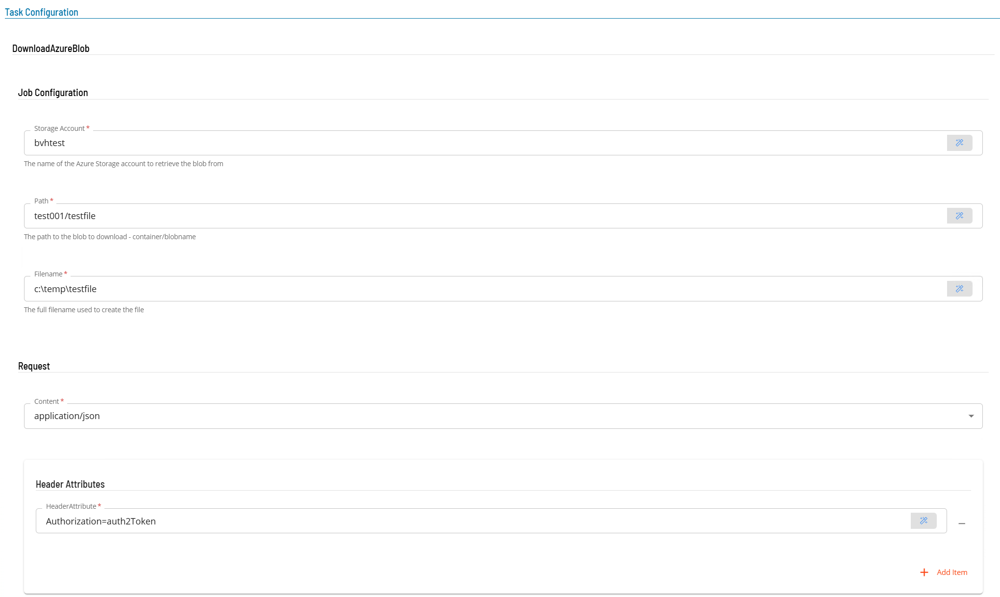
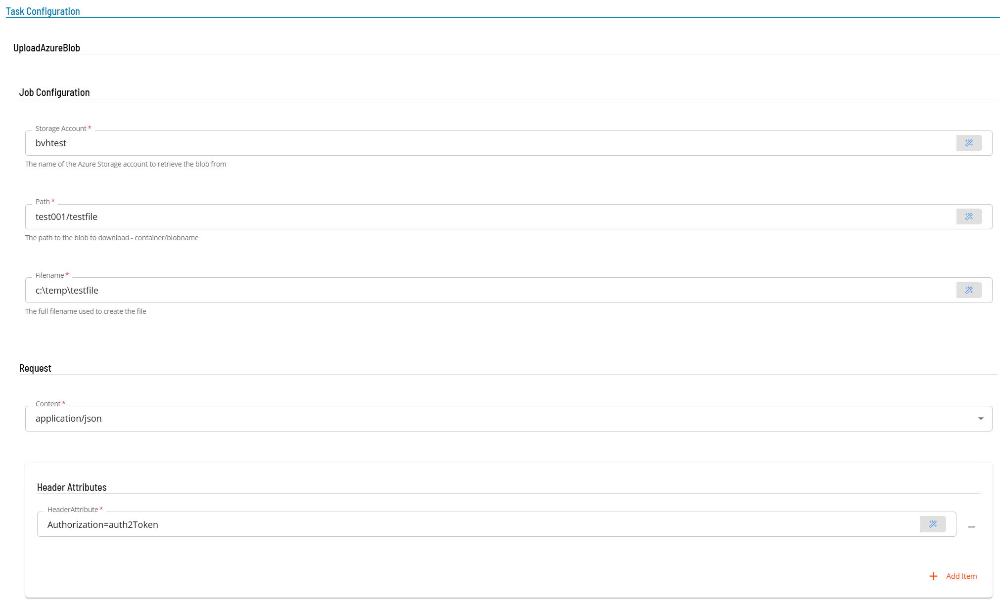

# ACS AzureWebservices Operation

Once the sma.acs.ACSAzureWebservices plugin has been registered with the OpCon system, it will be possible to perform agent and task definitions.
All definitions can only be performed using Solution Manager.

## Defining ACS AzureWebservices connection

The Agent definition is defined by adding a new ACS AzureWebservices Agent definition using Solution Manager.
Items defined in red are required values.

1.  Open Solution Manager.
2.  From the Home page select **Library**
3.  From the ***Administration*** Menu select **Agents**.
4.  Select **+Add** to add a new agent definition.
5.  Fill in the agent details
    - Insert a unique name for the connection.
    - Select **ACS AzureWebservices** from the **Type** drop-down list.
    - Select **ACS AzureWebservices Settings**
    - The **Azure URL** field contains a default value ***azure.status.microsoft/en-us/status*** which is used as a heartbeat to check if the Azure environment is available. 
6.  Save the definition changes. 
7.  Start the connection by selecting the **Change Communication Status** button and selecting **Enable Full Comm.**. 

## Defining tasks

The ACS AzureWebservices Connection supports the following task types:

TaskType             | Description
---------------------|------------
GetOAuth2Token       | Get an OAuth2 token 
GetPatToken          | Create a Azure DevOps authentication token using a PAT (Personal Access Token)
RunDevOpsPipeline    | Starts an Azure DevOps pipeline and monitors for completion
DownloadBlobStorage  | Download a file from Azure Blob Storage
UploadBlobStorage    | Upload a file to Azure Blob Storage

Before defining a **RunDevOpsPipeline** task, a **GetPatToken** task must be defined to create the authorization token required by the RunDevOpsPipeline Task. Similarly before defining the **DownloadBlobStorage** or **UploadBlobStorage** tasks a **GetOAuth2Token** must be defines to create the autherization task required by the DownloadBlobStorage and UploadBlobStorage tasks.

The generated authentication tasks (GetPatToken, GetOAuth2Token) store the generated token as schedule instance properties of the schedule. These properties are then available for subsequent tasks in the schedule. 

### GetOAuth2Token Task

The GetOAuth2Token task is used to get an OAuth2 token and set it as a schedule instance property so it can be used to provide authentication by subsequent Azure tasks.

1.  Open Solution Manager.
2.  From the Home page select **Library**
3.  From the ***Administration*** Menu select **Master Jobs**.
4.  Select **+Add** to add a new master job definition.
5.  Fill in the task details.
    - Select the **Schedule** name from the drop-down list.
    - In the **Name** field enter a unique name for the task within the schedule.
    - Select **ACS AzureWebservices** from the **Job Type** drop-down list.
    - Select **GetOAuth2Token** from the **Task Type** drop-down list.
    
Enter details for Task Type **GetOAuth2Token**. 

1.  Select the **Task Details** button.
2.  In the **Integration** section, enter the information to obtain an authentication token. Items defined in red are required values.
3.  In the **Authentication** section, field enter the Url, client, key and resource information. Select the Grant Type and enter a name value pair in the Response Variable section to contain the generated token.
    - In the **Url** field enter the information to where to retrieve the url from. The value includes the unique tenant id (i.e. tenant-id/oauth2/token).
    - In the **Clientid** field enter the client id created during the Azure Application registration process.
    - In the **Key** field enter the key created during the Azure Application registration process.
    - In the **Resource** field, enter the storage resource containing the storage account name (i.e. https://storage-account.blob.core.windows.net).
    - Select ***client_credentials*** from the drop-down list of the **Grant Type** field.
 4. In the **Request** section enter the following information
    - Select ***application/x-www-form-urlencoded*** from the **Content** the drop-down list.

 5.  In the **Response** section enter the following information
    - Select ***application/json*** from the **Content** the drop-down list.
    - In the **Response Variable** section, define the variable that will contain the OAuth2 token. The format is name=value where the name part will be the schedule instance property name, the value part is ignored.  

### GetPatToken Task

The GetPatToken task is used to set a PAT token as a schedule instance property so it can be used to provide authentication by subsequent Azure DevOps tasks.   

1.  Open Solution Manager.
2.  From the Home page select **Library**
3.  From the ***Administration*** Menu select **Master Jobs**.
4.  Select **+Add** to add a new master job definition.
5.  Fill in the task details.
    - Select the **Schedule** name from the drop-down list.
    - In the **Name** field enter a unique name for the task within the schedule.
    - Select **ACS AzureWebservices** from the **Job Type** drop-down list.
    - Select **GetPatToken** from the **Task Type** drop-down list.
    
Enter details for Task Type **GetPatToken**. 

1.  Select the **Task Details** button.
2.  In the **Integration Selection** section, select the primary integration which is an ACS AzureWebservices connection previously defined.
3.  In the **Authentication** section, enter a PAT (Personal Action Token) retrieved from the Azure DevOps environment (see https://learn.microsoft.com/en-us/azure/devops/organizations/accounts/use-personal-access-tokens-to-authenticate?view=azure-devops&tabs=Windows for information on how to create a PAT).
4.  In the **Response Variable** section, define the variable that will contain the PAT token. The format is name=value where the name part will be the schedule instance property name, the value part is ignored. 

### RunDevOpsPipeline Task

The RunDevOpsPipeline task is used to start a DevOps pipeline and monitor the started task for completion. 
A Job Dependency should be defined on a previous **GetPatToken** task.   

1.  Open Solution Manager.
2.  From the Home page select **Library**
3.  From the ***Administration*** Menu select **Master Jobs**.
4.  Select **+Add** to add a new master job definition.
5.  Fill in the task details.
    - Select the **Schedule** name from the drop-down list.
    - In the **Name** field enter a unique name for the task within the schedule.
    - Select **ACS AzureWebservices** from the **Job Type** drop-down list.
    - Select **RunDevOpsPipeline** from the **Task Type** drop-down list.
    
Enter details for Task Type **RunDevOpsPipeline**. Fields marked in red must be provided.

1.  Select the **Task Details** button.
2.  In the **Integration Selection** section, select the primary integration which is an ACS AzureWebservices connection previously defined.
3.  In the **Job Configuration** section enter the following information
    - In the **Azure Url** field enter ***dev.azure.com***.
    - In the **Organization** field enter the name of the DevOps Organization.
    - In the **Project** field enter the name of the DevOps Project within the DevOps Organization.
    - In the **Pipeline Name** field, enter the name of the DevOps pipeline to execute. 
4.  In the **Request** section enter the following information
    - Select the **Content** from the drop-down list.
    - In the **Header Attributes** section, add an ***Authorization=name*** where the name portion is the name portion assigned to contain the PAT token in a previous GetPatToken task.
5.  In the **Response** section enter the following information
    - Select the **Content** from the drop-down list.
    - In the **Response Variables** section a variable can be defined to contain data extracted from the returned JSON data. The
    extracted data will be stored as a schedule instance property in the schedule making the extracted information available to subsequent tasks. 
    The format of the field definition is variable-name=jsonpath where
    - variable-name is the name of the variable that will be created as a schedule instance property.
    - jsonpath is the attribute value to extract from the returned JSON data using JPath notation 
    (i.e. ***$.id*** indicates extract the value of the first ***id*** attribute in the returned JSON,
          ***$.[0].id*** indicates extract the value of the first ***id*** attribute from the first record in the returned JSONArray).

### DownloadStorageBlob Task

The UploadBlobStorage task is upload a file to Azure BlobStorage. 
A Job Dependency should be defined on a previous **GetOAuth2Token** task.   

1.  Open Solution Manager.
2.  From the Home page select **Library**
3.  From the ***Administration*** Menu select **Master Jobs**.
4.  Select **+Add** to add a new master job definition.
5.  Fill in the task details.
    - Select the **Schedule** name from the drop-down list.
    - In the **Name** field enter a unique name for the task within the schedule.
    - Select **ACS AzureWebservices** from the **Job Type** drop-down list.
    - Select **DownloadBlobStorage** from the **Task Type** drop-down list.
    
Enter details for Task Type **UploadBlobStorage**. Fields marked in red must be provided.

1.  Select the **Task Details** button.
2.  In the **Integration Selection** section, select the primary integration which is an ACS AzureWebservices connection previously defined.
3.  In the **DownloadAzureBlob** section enter the following information
    - In the **Storage Account** field enter the name of the storage account.
    - In the **Path** field enter the path of the file to be downloaded from the storage area. The value consists of
    the container name and the filename (i.e. container/filename).
    - In the **Filename** field enter the name of the file to create. Please note that the file location is relative to the system where the plugin is installed.
4.  In the **Request** section enter the following information
    - Select the **Content** from the drop-down list.
    - In the **Header Attributes** section, add an ***Authorization=name*** where the name portion is the name portion assigned to contain the OAuth2 token in a previous GetOAuth2Token task.

### UploadStorageBlob Task

The UploadBlobStorage task is upload a file to Azure BlobStorage. 
A Job Dependency should be defined on a previous **GetOAuth2Token** task.   

1.  Open Solution Manager.
2.  From the Home page select **Library**
3.  From the ***Administration*** Menu select **Master Jobs**.
4.  Select **+Add** to add a new master job definition.
5.  Fill in the task details.
    - Select the **Schedule** name from the drop-down list.
    - In the **Name** field enter a unique name for the task within the schedule.
    - Select **ACS AzureWebservices** from the **Job Type** drop-down list.
    - Select **UploadBlobStorage** from the **Task Type** drop-down list.
    
Enter details for Task Type **UploadBlobStorage**. Fields marked in red must be provided.

1.  Select the **Task Details** button.
2.  In the **Integration Selection** section, select the primary integration which is an ACS AzureWebservices connection previously defined.
3.  In the **UploadAzureBlob** section enter the following information
    - In the **Storage Account** field enter the name of the storage account.
    - In the **Path** field enter the path where the file must be placed within the storage area. The value consists of
    the container name and the filename (i.e. container/filename).
    - In the **Filename** field enter the name of the file to upload. Please note that the file location is relative to the system where the plugin is installed.
4.  In the **Request** section enter the following information
    - Select the **Content** from the drop-down list.
    - In the **Header Attributes** section, add an ***Authorization=name*** where the name portion is the name portion assigned to contain the OAuth2 token in a previous GetOAuth2Token task.
