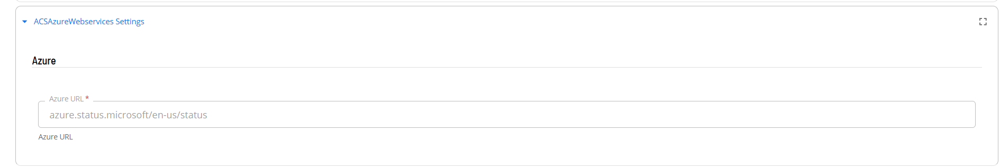
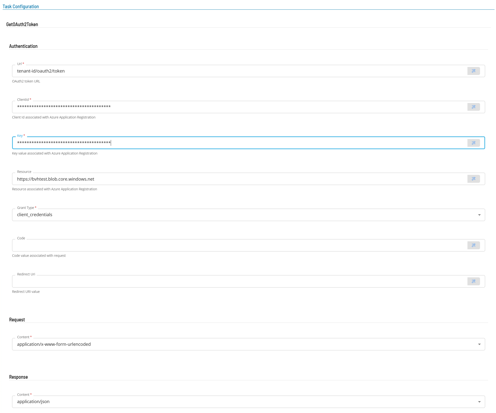
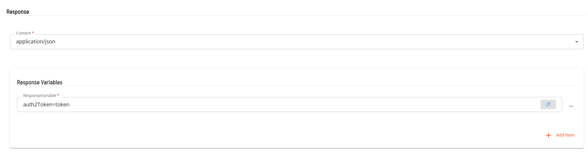
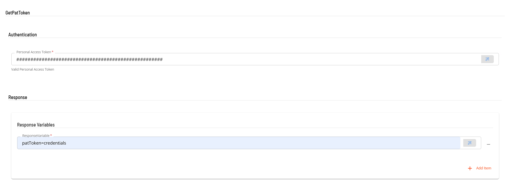
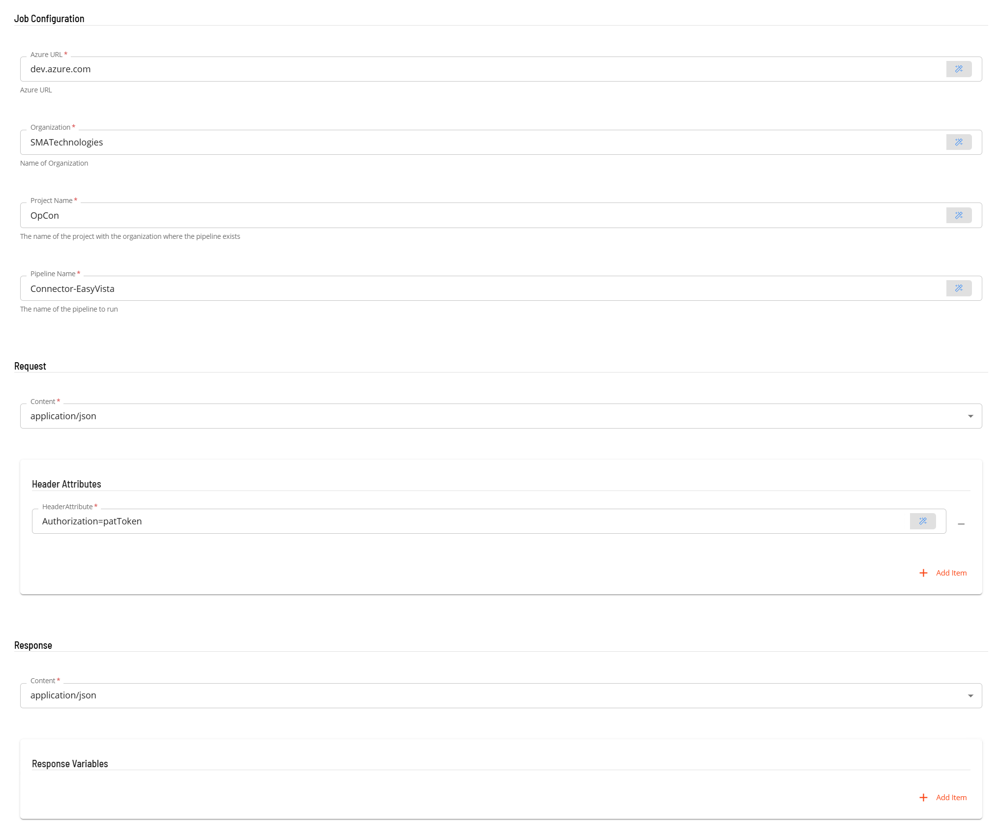
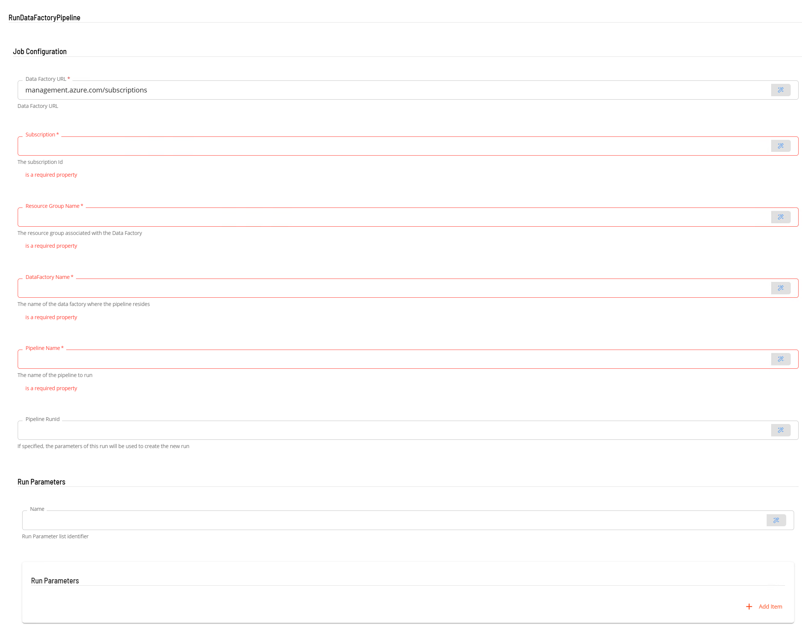
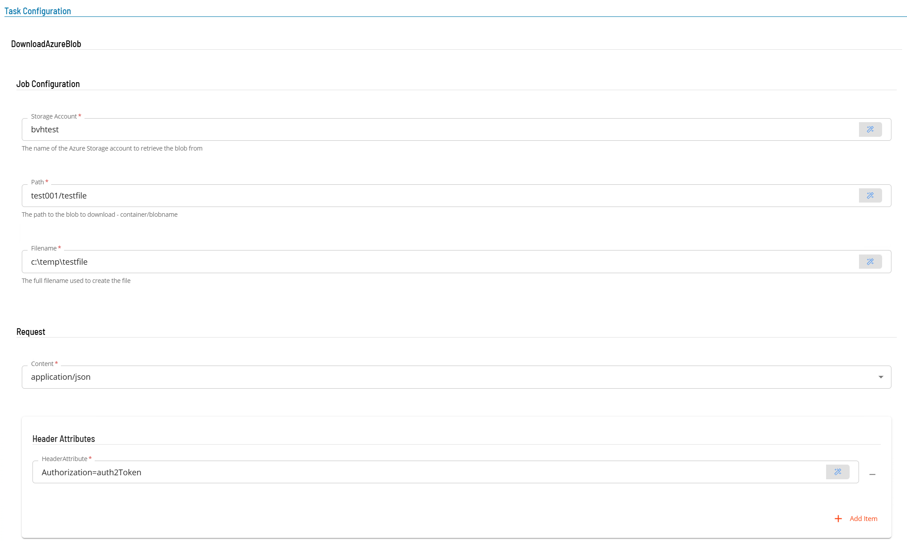
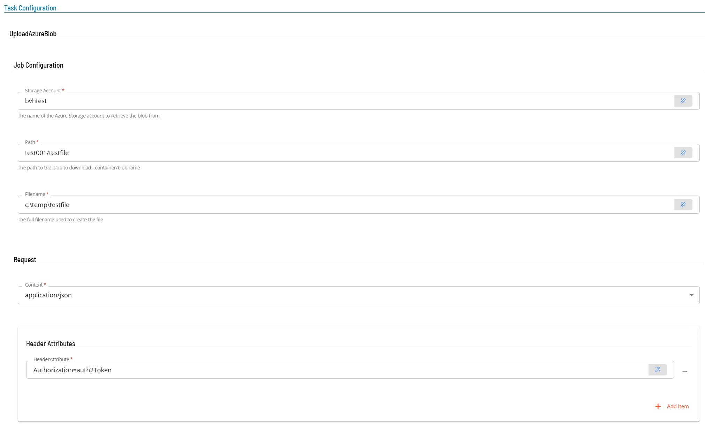

# ACS AzureWebservices operation

**Theme:** Configure
**Who is it for?** Automation Engineer, System Administrator

## What is it?

The ACS AzureWebservices connector enables OpCon jobs to interact with Microsoft Azure services as part of automated schedules. Once the connector is registered with OpCon, you can define an agent connection and create jobs that run Azure DevOps pipelines, run Data Factory pipelines, retrieve values from Azure Key Vault, and upload or download files from Azure Blob Storage.

- Use this connector when you need to integrate OpCon with Azure services such as Azure DevOps, Azure Data Factory, Azure Key Vault, or Azure Blob Storage
- Use the GetOAuth2Token job type to obtain OAuth2 tokens for Data Factory, Key Vault, and Blob Storage operations
- Use the GetPatToken job type to obtain a PAT token for Azure DevOps pipeline operations

## Defining the ACS AzureWebservices connection

The agent definition is created by adding a new ACS AzureWebservices agent in Solution Manager. Required fields are shown in red.

To define the ACS AzureWebservices connection, complete the following steps:

1. Open Solution Manager.
2. From the Home page, select **Library**.
3. From the **Administration** menu, select **Agents**.
4. Select **+Add**.
5. Enter the agent details:
   - Enter a unique name for the connection.
   - Select **ACS AzureWebservices** from the **Type** list.
   - Select **General Settings**.
   - In the **NetCom** field, enter `<Default>` or a Netcom or Relay name.
   - Select **ACS AzureWebservices Settings**.
   - The **Azure URL** field defaults to `azure.status.microsoft/en-us/status`, used as a heartbeat to check Azure availability.
   - In the **OpCon URL** field, enter the address and port of the host OpCon system.
   - In the **OpCon Token** field, enter a token for authenticating to the host OpCon system via the OpCon REST API.
   - In the **Retain Log files** field, enter the number of days to retain log files (default is 30).
   - (Optional) Select the **Debug Mode** option to enable debug logging.
6. Select **Save**.
7. Select **Communications Settings**, set **Requires XML Escape Sequences:User-Defined** to **True**, then select **Save**.
8. Select the **Change Communication Status** button and select **Enable Full Comm.**

## Defining jobs

The ACS AzureWebservices connection supports the following job types:

| Job type | Description |
|---|---|
| GetOAuth2Token | Retrieve an OAuth2 token for Azure services |
| GetPatToken | Create an Azure DevOps authentication token using a Personal Access Token |
| GetKeyVaultValue | Retrieve a secret, key, or certificate from Azure Key Vault |
| RunDevOpsPipeline | Start an Azure DevOps pipeline and monitor for completion |
| RunDataFactoryPipeline | Start a Microsoft Data Factory pipeline and monitor for completion |
| DownloadBlobStorage | Download a file from Azure Blob Storage |
| UploadBlobStorage | Upload a file to Azure Blob Storage |

**Authentication dependencies:** Define a GetPatToken job before RunDevOpsPipeline. Define a GetOAuth2Token job before GetKeyVaultValue, RunDataFactoryPipeline, DownloadBlobStorage, or UploadBlobStorage. Set job dependencies so the authentication job runs first. The generated tokens are stored as schedule instance properties or OpCon properties and passed automatically to subsequent jobs.

### Prerequisite steps for all job definitions

Every job type in this connector follows the same steps to open the job definition form. Complete the following steps before configuring the job-type-specific fields described in each section below.

To open the master job definition form, complete the following steps:

1. Open Solution Manager.
2. From the Home page, select **Library**.
3. From the **Administration** menu, select **Master Jobs**.
4. Select **+Add**.
5. In the **Schedule** list, select the schedule.
6. In the **Name** field, enter a unique name for the job.
7. In the **Job Type** list, select **ACS AzureWebservices**.
8. In the **Task Type** list, select the job type you want to configure.
9. Select the **Task Details** button.

Continue with the job-type-specific steps in the section below.

---

### GetOAuth2Token job

The GetOAuth2Token job retrieves an OAuth2 token and stores it as a schedule instance property or OpCon property for use by subsequent jobs that interact with Azure Data Factory, Key Vault, or Blob Storage.

After completing the [prerequisite steps](#prerequisite-steps-for-all-job-definitions) and selecting **GetOAuth2Token** as the task type:

1. In the **Integration** section, confirm required fields (shown in red).
2. In the **Authentication** section:
   - In the **Url** field, enter the token endpoint URL including the tenant ID (for example, `tenant-id/oauth2/token`).
   - In the **Clientid** field, enter the client ID from the Azure Application registration.
   - In the **Key** field, enter the key from the Azure Application registration.
   - In the **Resource** field, enter the storage resource (for example, `https://storage-account.blob.core.windows.net`).
   - Select **client_credentials** from the **Grant Type** list.
   - In the **OpCon Property** field, enter the property name where the token will be stored. You can use instance properties if the full path is provided.
3. In the **Request** section, select **application/x-www-form-urlencoded** from the **Content** list.

   

4. (Optional) If not using OpCon properties, in the **Response** section:
   - Select **application/json** from the **Content** list.
   - In **Response Variable**, enter the variable in the format `name=value` where `name` is the schedule instance property name (the value is ignored).
5. Select **Save**. The GetOAuth2Token job is added to the schedule.

---

### GetPatToken job

The GetPatToken job encodes a Personal Access Token (PAT) from Azure DevOps and stores it for use by a subsequent RunDevOpsPipeline job.

After completing the [prerequisite steps](#prerequisite-steps-for-all-job-definitions) and selecting **GetPatToken** as the task type:

1. In the **Integration Selection** section, select the ACS AzureWebservices connection.
2. In the **Authentication** section:
   - Enter the PAT retrieved from Azure DevOps. For instructions on creating a PAT, see the [Microsoft documentation](https://learn.microsoft.com/en-us/azure/devops/organizations/accounts/use-personal-access-tokens-to-authenticate?view=azure-devops&tabs=Windows).
   - In the **OpCon Property** field, enter the property name where the token will be stored. You can use instance properties if the full path is provided.
3. (Optional) If not using OpCon properties, in the **Response Variable** section, enter the variable in the format `name=value` where `name` is the schedule instance property name.
4. Select **Save**. The GetPatToken job is added to the schedule.

---

### GetKeyVaultValue job

The GetKeyVaultValue job retrieves a secret, key, or certificate from Azure Key Vault and stores the result in an OpCon property.

**Prerequisite:** A GetOAuth2Token job must run before this job and the OAuth2 token must be available.

After completing the [prerequisite steps](#prerequisite-steps-for-all-job-definitions) and selecting **GetKeyVaultValue** as the task type:

1. In the **Integration Selection** section, select the ACS AzureWebservices connection.
2. In the **Job Configuration** section:
   - In the **Vault Url** field, enter the address of the Azure Key Vault.
   - In the **Type** field, select **secret**, **key**, or **certificate** from the list.
   - In the **Name** field, enter the name of the key vault item.
   - In the **version** field, enter the version to retrieve. Leave empty to retrieve the latest version.
   - If the type is **key** or **certificate**, select the attribute to return from the **Attribute** field:
     - Key attributes: `Key.kid`, `Key.kty`, `Key.D`, `Key.Dp`, `Key.Dq`, `Key.E`, `Key.K`, `Key.N`, `Key.P`, `Key.Q`, `Key.Qi`, `Key.X`, `Key.Y`
     - Certificate attributes: `Cert.kid`, `Cert.sid`, `Cert.x5t`, `Cert.cer`
   - In the **OpCon Property** field, enter the property name where the retrieved value will be stored.
   - In **Header Attributes**, enter `Authorization=name` where `name` is the OpCon property name or response variable name that contains the OAuth2 token.
3. Select **Save**. The GetKeyVaultValue job is added to the schedule.

---

### RunDevOpsPipeline job

The RunDevOpsPipeline job starts an Azure DevOps pipeline and monitors it until it completes.

**Prerequisite:** A GetPatToken job must run before this job and set a job dependency from RunDevOpsPipeline to GetPatToken.

After completing the [prerequisite steps](#prerequisite-steps-for-all-job-definitions) and selecting **RunDevOpsPipeline** as the task type:

1. In the **Integration Selection** section, select the ACS AzureWebservices connection.
2. In the **Job Configuration** section (required fields shown in red):
   - In the **Azure Url** field, enter `dev.azure.com`.
   - In the **Organization** field, enter the DevOps organization name.
   - In the **Project** field, enter the DevOps project name.
   - In the **Pipeline Name** field, enter the DevOps pipeline name to run.
3. In the **Request** section:
   - Select the content type from the **Content** list.
   - In **Header Attributes**, enter `Authorization=name` where `name` is the OpCon property name or response variable name that contains the PAT token.
4. In the **Response** section:
   - Select the content type from the **Content** list.
   - (Optional) In **Response Variables**, enter a variable in the format `variable-name=jsonpath` to extract a value from the response and store it as a schedule instance property. For example, `$.id` extracts the first `id` attribute; `$.[0].id` extracts the first `id` from the first record in a JSON array.
5. Select **Save**. The RunDevOpsPipeline job is added to the schedule.

---

### RunDataFactoryPipeline job

The RunDataFactoryPipeline job starts a Microsoft Data Factory pipeline and monitors it until it completes.

**Prerequisite:** A GetOAuth2Token job must run before this job and set a job dependency from RunDataFactoryPipeline to GetOAuth2Token.

After completing the [prerequisite steps](#prerequisite-steps-for-all-job-definitions) and selecting **RunDataFactoryPipeline** as the task type:

1. In the **Integration Selection** section, select the ACS AzureWebservices connection.
2. In the **Job Configuration** section (required fields shown in red):
   - In the **Data Factory Url** field, enter `management.azure.com/subscription`.
   - In the **Subscription** field, enter the Azure subscription ID.
   - In the **Resource Group Name** field, enter the resource group where the Data Factory is defined.
   - In the **Data Factory Name** field, enter the Data Factory name.
   - In the **Pipeline Name** field, enter the pipeline name to run.
   - (Optional) In **Pipeline Runid**, enter a run ID to re-run a specific previous execution.
   - (Optional) In the **Run Parameters** section, enter a name and values to pass as run parameters. Select **+Add Item** to add additional parameters.
3. In the **Request** section:
   - Select **application/json** from the **Content** list.
   - In **Header Attributes**, enter `Authorization=name` where `name` is the OpCon property name or response variable name that contains the OAuth2 token.
4. (Optional) In the **Pipeline Recovery** section, configure restart behavior:
   - Select the **Recovery** option to enable recovery.
   - To restart from a specific activity, enter the activity name in **Start Activity Name**.
   - To restart from the beginning, leave **Start Activity Name** empty and do not select **Start From Failure**.
   - To restart from the failed activity, select the **Start From Failure** option.
5. Select **Save**. The RunDataFactoryPipeline job is added to the schedule.

---

### DownloadBlobStorage job

The DownloadBlobStorage job downloads a file from Azure Blob Storage to the system where the connector is installed.

**Prerequisite:** A GetOAuth2Token job must run before this job and set a job dependency from DownloadBlobStorage to GetOAuth2Token.

After completing the [prerequisite steps](#prerequisite-steps-for-all-job-definitions) and selecting **DownloadBlobStorage** as the task type:

1. In the **Integration Selection** section, select the ACS AzureWebservices connection.
2. In the **DownloadAzureBlob** section:
   - In the **Storage Account** field, enter the storage account name.
   - In the **Path** field, enter the path of the file in storage using the format `container/filename`.
   - In the **Filename** field, enter the local path and name of the file to create. The path is relative to the system where the connector is installed.
3. In the **Request** section:
   - Select the content type from the **Content** list.
   - In **Header Attributes**, enter `Authorization=name` where `name` is the OpCon property name or response variable name that contains the OAuth2 token.
4. Select **Save**. The DownloadBlobStorage job is added to the schedule.

---

### UploadBlobStorage job

The UploadBlobStorage job uploads a file from the system where the connector is installed to Azure Blob Storage.

**Prerequisite:** A GetOAuth2Token job must run before this job and set a job dependency from UploadBlobStorage to GetOAuth2Token.

After completing the [prerequisite steps](#prerequisite-steps-for-all-job-definitions) and selecting **UploadBlobStorage** as the task type:

1. In the **Integration Selection** section, select the ACS AzureWebservices connection.
2. In the **UploadAzureBlob** section:
   - In the **Storage Account** field, enter the storage account name.
   - In the **Path** field, enter the destination path in storage using the format `container/filename`.
   - In the **Filename** field, enter the local path and name of the file to upload. The path is relative to the system where the connector is installed.
3. In the **Request** section:
   - Select the content type from the **Content** list.
   - In **Header Attributes**, enter `Authorization=name` where `name` is the OpCon property name or response variable name that contains the OAuth2 token.
4. Select **Save**. The UploadBlobStorage job is added to the schedule.

---

## FAQs

**Which authentication job do I need before running a DevOps pipeline?**
Define a GetPatToken job and set a job dependency from the RunDevOpsPipeline job to the GetPatToken job. The PAT token must be available as a schedule instance property or OpCon property before RunDevOpsPipeline runs.

**Which authentication job do I need before running a Data Factory pipeline, accessing Key Vault, or using Blob Storage?**
Define a GetOAuth2Token job and set a job dependency from the downstream job to the GetOAuth2Token job. The OAuth2 token must be available before the subsequent job runs.

**How do I store a token for use across multiple jobs?**
Enter a property name in the **OpCon Property** field of the GetOAuth2Token or GetPatToken job to store the token as an OpCon property accessible across schedules. Alternatively, use **Response Variable** to store it as a schedule instance property scoped to the current schedule run.

**What value do I enter in the Azure Url field for a RunDevOpsPipeline job?**
Enter `dev.azure.com` in the **Azure Url** field.

**What is the default value of the Azure URL field in the connection definition?**
The default value is `azure.status.microsoft/en-us/status`. This URL is used as a heartbeat check to verify that the Azure environment is available.

**Can I restart a Data Factory pipeline from a specific point if it fails?**
Yes. In the **Pipeline Recovery** section of a RunDataFactoryPipeline job, select the **Recovery** option and enter the restart point in the **Start Activity Name** field. To restart from the failed activity, select **Start From Failure** instead.

## Glossary

**ACS AzureWebservices** — An OpCon connector that enables jobs to interact with Microsoft Azure services including Azure DevOps, Azure Data Factory, Azure Key Vault, and Azure Blob Storage.

**GetOAuth2Token** — A job type that retrieves an OAuth2 token from an Azure OAuth2 endpoint and stores it as a schedule instance property or OpCon property for use by subsequent jobs.

**GetPatToken** — A job type that encodes a Personal Access Token (PAT) for Azure DevOps and stores it as a schedule instance property or OpCon property for use by subsequent jobs.

**GetKeyVaultValue** — A job type that retrieves a secret, key, or certificate from an Azure Key Vault and stores the result in an OpCon property.

**RunDevOpsPipeline** — A job type that starts an Azure DevOps pipeline and monitors it until the pipeline completes.

**RunDataFactoryPipeline** — A job type that starts a Microsoft Data Factory pipeline and monitors it until the pipeline completes.

**DownloadBlobStorage** — A job type that downloads a file from Azure Blob Storage to the system where the connector is installed.

**UploadBlobStorage** — A job type that uploads a file from the system where the connector is installed to Azure Blob Storage.

**PAT (Personal Access Token)** — An authentication credential created in Azure DevOps that grants access to DevOps resources. Used by the GetPatToken job type.

**Schedule instance property** — A named value scoped to a single running instance of a schedule. Used to pass data such as authentication tokens between jobs within the same schedule run.

**OpCon property** — A named value stored in OpCon that can be used across schedules and jobs. Authentication tokens can be stored as OpCon properties for use beyond a single schedule instance.

**JPath** — A query notation for extracting values from JSON documents. Used in the **Response Variables** field to target specific attributes in a JSON response.
