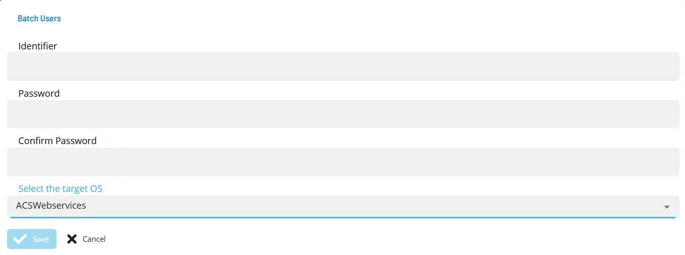

# ACSWebservices Operation

Once the sma.acs.ACSWebservices plugin has been registered with the OpCon system, it will be possible to perform agent and task definitions.
All definitions can only be performed using Solution Manager.

## Defining ACSWebservices Batch Users

The ACSWebservices task types BASICTOKEN and OPCONTOKEN uses opCon Batch users to define the user information for these task types.
Before creating these task types, ensure that the appropriate Batch Users are created.  

1.  Open Solution Manager.
2.  From the Home page select **Library**
3.  From the ***Security*** Menu select **Batch Users**.
4.  Select **+Add** to add a new Batch User.
5.  Select **ACSWebservices** from the ***Select the target OS*** drop-down list.
6.  Enter the User name that will be used to create the token in the **Identifier** field.
7.  Enter the password of the defined API User in the **Password** and **Confirm** fields.
8.  Select **Save**.

## Defining ACSWebservices connection

The Agent definition is defined by adding a new ACSWebservices Agent definition using Solution Manager.
Items defined in red are required values.

1.  Open Solution Manager.
2.  From the Home page select **Library**
3.  From the ***Administration*** Menu select **Agents**.
4.  Select **+Add** to add a new agent definition.
5.  Fill in the agent details
    - Insert a unique name for the connection.
    - Select **ACSWebservices** from the **Type** drop-down list.
    - Select **ACSWebservices Settings**
    - In the **OpCon URL** field enter the full url for the associated OpCon Rest-API server.
    - In the **OpCon Token** field enter a valid OpCon application token that will be used to authenticate internal OpCon Rest-API requests.
    - In the **Proxy Url** field enter the full url of the Proxy Server if required when submitting url requests outside the organization.  
6.  Save the definition changes. 
7.  Start the connection by selecting the **Change Communication Status** button and selecting **Enable Full Comm.**. 

## Defining tasks

The ACSWebservices Connection supports the following task types:

TaskType             | Description
---------------------|------------
BASICTOKEN           | Create a basic token. 
OPCONTOKEN           | Retrieve an OpCon token from an opCon system.
OAUTH2TOKEN          | Retrieve an OAuth2 Token.
GET                  | Perform a GET HTTP request.
POST                 | Perform a POST HTTP request.
PUT                  | Perform a PUT HTTP request.
PATCH                | Perform a PATCH HTTP request.
DELETE               | Perform a DELETE HTTP request.

Before defining a **GET**, **POST**, **PUT**, **PATCH** or **DELETE** task, the authentication method must be defined to create the authorization token required by these tasks. 

The generated authentication tasks (BASICTOKEN, OPCONTOKEN or OAUTH2TOKEN) store the generated token as schedule instance properties of the schedule. These properties are then available for subsequent tasks in the schedule. 

Data is passed between tasks using schedule instance properties. The ACS environment calls these properties 'scoped properties' and the list is automatically passed to each task. When using this mechanism, it is only required to define these values in the **Response Variables** field. 

### BASICTOKEN Task

The BASICTOKEN task is used to set a basic token as a schedule instance property so it can be used to provide authentication by subsequent tasks. 
The function allows the selection of a ACSWebservices Batch User to provide the base64 encoded authentication string.   

1.  Open Solution Manager.
2.  From the Home page select **Library**
3.  From the ***Administration*** Menu select **Master Jobs**.
4.  Select **+Add** to add a new master job definition.
5.  Fill in the task details.
    - Select the **Schedule** name from the drop-down list.
    - In the **Name** field enter a unique name for the task within the schedule.
    - Select **ACSWebservices** from the **Job Type** drop-down list.
    - Select **BASICTOKEN** from the **Task Type** drop-down list.
    
Enter details for Task Type **BASICTOKEN**. 

1.  Select the **Task Details** button.
2.  In the **Integration Selection** section, select the primary integration which is an ACSWebservices connection previously defined.
3.  In the **Authentication** section
    - select a Batch User from the drop-down list.
4.  In the **Response Variable** section
    - define the variable that will contain the token. The format is name=value where the name part will be the schedule instance property name, the value part is ignored. 

### OpConTOKEN Task

The OPCONTOKEN task is used to set an OpCon token as a schedule instance property so it can be used to provide authentication by subsequent tasks. 
The function allows the selection of a ACSWebservices Batch User to provide the OpCon encoded authentication string.   

1.  Open Solution Manager.
2.  From the Home page select **Library**
3.  From the ***Administration*** Menu select **Master Jobs**.
4.  Select **+Add** to add a new master job definition.
5.  Fill in the task details.
    - Select the **Schedule** name from the drop-down list.
    - In the **Name** field enter a unique name for the task within the schedule.
    - Select **ACSWebservices** from the **Job Type** drop-down list.
    - Select **OPCONTOKEN** from the **Task Type** drop-down list.
    
Enter details for Task Type **OPCONTOKEN**. 

1.  Select the **Task Details** button.
2.  In the **Integration Selection** section, select the primary integration which is an ACSWebservices connection previously defined.
3.  In the **Authentication** section
    - In the **URL** field enter the full address of the end point (i.e. https://server:port/api/tokens). 
    - Select a Batch User from the drop-down list.
4.  In the **Request** section enter the following information
    - Select the **Content** from the drop-down list (application/json).   
5.  In the **Response** section
    - Select the **Content** from the drop-down list (application/json).   
    - In **Response Variables** define a variable to contain data extracted from the returned JSON data. The extracted data will be 
    stored as a schedule instance property in the schedule making the extracted information available to subsequent tasks. 
    The format of the field definition is variable-name=jsonpath (i.e. opconToken=$.id) where
    - variable-name is the name of the variable that will be created as a schedule instance property.
    - jsonpath is the attribute value to extract from the returned JSON data using JPath notation - enter **$.id** 

### GET Task

The GET task is used to retrieve data from a remote Rest-API. Prior to executing a GET request if authentication is required, an authentication task (BASICTOKEN, OAUTH2TOKEN or OPCONTOKEN) must be executed successfully to store the required token as a schedule instance property of the schedule.
The GET task should have a dependency set on the authentication task.  

Variables can be used to define values that will be replaced in the Url and MsgBody fields. This allows 'place holders' to be defines and the values
substituted during the execution of the task. Properties can also be used to provide dynamic or static values for variable substitution. An example 
would be to create a variable TestVar=ABC. The name of the variable TestVar which is defined in the Url or the MsgBody will be replaced with the value
ABC.    

1.  Open Solution Manager.
2.  From the Home page select **Library**
3.  From the ***Administration*** Menu select **Master Jobs**.
4.  Select **+Add** to add a new master job definition.
5.  Fill in the task details.
    - Select the **Schedule** name from the drop-down list.
    - In the **Name** field enter a unique name for the task within the schedule.
    - Select **ACSWebservices** from the **Job Type** drop-down list.
    - Select **GET** from the **Task Type** drop-down list.
    
Enter details for Task Type **GET**. 

1.  Select the **Task Details** button.
2.  In the **Integration Selection** section, select the primary integration which is an ACSWebservices connection previously defined.
3.  In the **Task Configuration** section
    - In **Variables** define name value pairs that can be used for substitution in url and message bodies. 
    - In the **Url** field enter the full address of the end point (i.e. https://server:port/api/tokens). 
    - From **Authentication** select an Authentication method for the task from the drop-down list (None, Basic, OAuth2, OpCon).

4.  In the **Request** section
    - Select the **Content** from the drop-down list (application/json).
    - In **Header Attributes** enter a reference to the authorization token previously created if an Authorization header is required. Enter a name value pair that contains the matching name of a schedule instance property (i.e. Authorization=Bearer ***schedule instance property name***).

5.  In the **Response** section
    - Select the **Content** from the drop-down list (application/json).   
6.  In the **Completion** section is an optional section that can be used to examine the value of an attribute in the returned JSON to determine if the task completed successfully. It can also be used to 'poll' on a regular basis until the task is completed.
    - Select the **POll** field to indicate that it should perform a poll as part of the completion process. If Poll is not selected a single check will be made on the defined Attribute using the Good and Bad Result values to determine the result.
    - In the **Attribute** field, enter the attribute location in JPath format (i.e. $.result.message).
    - In the **Good Result** field enter value(s) that define a good completion. Multiple values can be entered separated by a forward slash character (i.e. Success/Complete).
    - In the **Bad Result** field enter value(s) that define a failed completion. Multiple values can be entered separated by a forward slash character (i.e. Error/Failed).
    - In the **Max** field set the maximum time in minutes to poll checking the the defined Attribute using the Good and Bad Result values to determine the result. It is an optional value. If Polling is selected and no Max time is set, the polling will continue util a match is made.

### POST Task

The POST task is used to submit data to a remote Rest-API. Prior to executing a POST request if authentication is required, an authentication task (BASICTOKEN, OAUTH2TOKEN or OPCONTOKEN) must be executed successfully to store the required token as a schedule instance property of the schedule.
The POST task should have a dependency set on the authentication task.  

Variables can be used to define values that will be replaced in the Url and MsgBody fields. This allows 'place holders' to be defines and the values
substituted during the execution of the task. Properties can also be used to provide dynamic or static values for variable substitution. An example 
would be to create a variable TestVar=ABC. The name of the variable TestVar which is defined in the Url or the MsgBody will be replaced with the value
ABC. 

A special variable called **JCorrelationId** can be used to define a return point to the OpCon workflow after starting a task on a remote system. This 
approach prevents the need to 'poll' for task completion. The value of the variable consists of the ScheduleName, the JobName and the Date 
(format yyyy-mm-dd) of a task in the OpCon Daily tables. Before executing the POST request, the full jobId is retrieved through the OpCon Rest-API and
this is then used as the substitution value. The message body of the POST request should then include a 'JCorrelationId' place holder. The defined OpCon
task should be in a 'hold' state.  The remote system would then include the capability to submit a Rest-API request to mark the task as 'Finished OK' or 
'Failed' depending on the remote task completion. 

1.  Open Solution Manager.
2.  From the Home page select **Library**
3.  From the ***Administration*** Menu select **Master Jobs**.
4.  Select **+Add** to add a new master job definition.
5.  Fill in the task details.
    - Select the **Schedule** name from the drop-down list.
    - In the **Name** field enter a unique name for the task within the schedule.
    - Select **ACSWebservices** from the **Job Type** drop-down list.
    - Select **POST** from the **Task Type** drop-down list.
    
Enter details for Task Type **POST**. 

1.  Select the **Task Details** button.
2.  In the **Integration Selection** section, select the primary integration which is an ACSWebservices connection previously defined.
3.  In the **Task Configuration** section
    - In **Variables** define name value pairs that can be used for substitution in url and message bodies. 
    - In the **Url** field enter the full address of the end point (i.e. https://server:port/api/tokens). 
    - From **Authentication** select an Authentication method for the task from the drop-down list (None, Basic, OAuth2, OpCon).

4.  In the **Request** section
    - Select the **Content** from the drop-down list (application/json).
    - In **Header Attributes** enter a reference to the authorization token previously created if an Authorization header is required. Enter a name value pair that contains the matching name of a schedule instance property (i.e. Authorization=Bearer ***schedule instance property name***).
    - In the **Filename** field enter the name of a file that contains the message body to be submitted with the POST request. Please note that the file location is relative to the system where the plugin is installed (either a Filename or a Message Body must be present).
    - In the **Message Body** field, enter the message body to be submitted with the POST request. (either a Filename or a Message Body must be present).   

5.  In the **Response** section
    - Select the **Content** from the drop-down list (application/json).   
    - In the **Response Variables** if required, define a variable to contain data extracted from the returned JSON data. The extracted data will be 
    stored as a schedule instance property in the schedule making the extracted information available to subsequent tasks. 
    The format of the field definition is variable-name=jsonpath (i.e. acsPropid=$.id) where
    - variable-name is the name of the variable that will be created as a schedule instance property.
    - jsonpath is the attribute value to extract from the returned JSON data using JPath notation - enter **$.id** 
6.  In the **Completion** section is an optional section that can be used to examine the value of an attribute in the returned JSON to determine if the task completed successfully.
    - In the **Attribute** field, enter the attribute location in JPath format (i.e. $.result.message).
    - In the **Good Result** field enter value(s) that define a good completion. Multiple values can be entered separated by a forward slash character (i.e. Success/Complete).
    - In the **Bad Result** field enter value(s) that define a failed completion. Multiple values can be entered separated by a forward slash character (i.e. Error/Failed).

### PUT Task

The PUT task is used to submit data to a remote Rest-API. Prior to executing a PUT request if authentication is required, an authentication task (BASICTOKEN, OAUTH2TOKEN or OPCONTOKEN) must be executed successfully to store the required token as a schedule instance property of the schedule.
The PUT task should have a dependency set on the authentication task.  

Variables can be used to define values that will be replaced in the Url and MsgBody fields. This allows 'place holders' to be defines and the values
substituted during the execution of the task. Properties can also be used to provide dynamic or static values for variable substitution. An example 
would be to create a variable TestVar=ABC. The name of the variable TestVar which is defined in the Url or the MsgBody will be replaced with the value
ABC. 

1.  Open Solution Manager.
2.  From the Home page select **Library**
3.  From the ***Administration*** Menu select **Master Jobs**.
4.  Select **+Add** to add a new master job definition.
5.  Fill in the task details.
    - Select the **Schedule** name from the drop-down list.
    - In the **Name** field enter a unique name for the task within the schedule.
    - Select **ACSWebservices** from the **Job Type** drop-down list.
    - Select **PUT** from the **Task Type** drop-down list.
    
Enter details for Task Type **PUT**. 

1.  Select the **Task Details** button.
2.  In the **Integration Selection** section, select the primary integration which is an ACSWebservices connection previously defined.
3.  In the **Task Configuration** section
    - In **Variables** define name value pairs that can be used for substitution in url and message bodies. 
    - In the **Url** field enter the full address of the end point (i.e. https://server:port/api/tokens). 
    - From **Authentication** select an Authentication method for the task from the drop-down list (None, Basic, OAuth2, OpCon).

4.  In the **Request** section
    - Select the **Content** from the drop-down list (application/json).
    - In **Header Attributes** enter a reference to the authorization token previously created if an Authorization header is required. Enter a name value pair that contains the matching name of a schedule instance property (i.e. Authorization=Bearer ***schedule instance property name***).
    - In the **Filename** field enter the name of a file that contains the message body to be submitted with the PUT request. Please note that the file location is relative to the system where the plugin is installed (either a Filename or a Message Body must be present).
    - In the **Message Body** field, enter the message body to be submitted with the PUT request. (either a Filename or a Message Body must be present).   

5.  In the **Response** section
    - Select the **Content** from the drop-down list (application/json).   
    - In the **Response Variables** if required, define a variable to contain data extracted from the returned JSON data. The extracted data will be 
    stored as a schedule instance property in the schedule making the extracted information available to subsequent tasks. 
    The format of the field definition is variable-name=jsonpath (i.e. acsPropid=$.id) where
    - variable-name is the name of the variable that will be created as a schedule instance property.
    - jsonpath is the attribute value to extract from the returned JSON data using JPath notation - enter **$.id** 
6.  In the **Completion** section is an optional section that can be used to examine the value of an attribute in the returned JSON to determine if the task completed successfully.
    - In the **Attribute** field, enter the attribute location in JPath format (i.e. $.result.message).
    - In the **Good Result** field enter value(s) that define a good completion. Multiple values can be entered separated by a forward slash character (i.e. Success/Complete).
    - In the **Bad Result** field enter value(s) that define a failed completion. Multiple values can be entered separated by a forward slash character (i.e. Error/Failed).

### PATCH Task

The PATCH task is used to submit data to a remote Rest-API. When using a PATCH request, only the changed data needs to be included in the message body instead of the complete data (PUT request). Prior to executing a PATCH request if authentication is required, an authentication task (BASICTOKEN, OAUTH2TOKEN or OPCONTOKEN) must be executed successfully to store the required token as a schedule instance property of the schedule.
The PATCH task should have a dependency set on the authentication task.  

Variables can be used to define values that will be replaced in the Url and MsgBody fields. This allows 'place holders' to be defines and the values
substituted during the execution of the task. Properties can also be used to provide dynamic or static values for variable substitution. An example 
would be to create a variable TestVar=ABC. The name of the variable TestVar which is defined in the Url or the MsgBody will be replaced with the value
ABC. 

1.  Open Solution Manager.
2.  From the Home page select **Library**
3.  From the ***Administration*** Menu select **Master Jobs**.
4.  Select **+Add** to add a new master job definition.
5.  Fill in the task details.
    - Select the **Schedule** name from the drop-down list.
    - In the **Name** field enter a unique name for the task within the schedule.
    - Select **ACSWebservices** from the **Job Type** drop-down list.
    - Select **PTCH** from the **Task Type** drop-down list.
    
Enter details for Task Type **PATCH**. 

1.  Select the **Task Details** button.
2.  In the **Integration Selection** section, select the primary integration which is an ACSWebservices connection previously defined.
3.  In the **Task Configuration** section
    - In **Variables** define name value pairs that can be used for substitution in url and message bodies. 
    - In the **Url** field enter the full address of the end point (i.e. https://server:port/api/tokens). 
    - From **Authentication** select an Authentication method for the task from the drop-down list (None, Basic, OAuth2, OpCon).

4.  In the **Request** section
    - Select the **Content** from the drop-down list (application/json-patch+json).
    - In **Header Attributes** enter a reference to the authorization token previously created if an Authorization header is required. Enter a name value pair that contains the matching name of a schedule instance property (i.e. Authorization=Bearer ***schedule instance property name***).
    - In the **Message Body** field, enter the message body to be submitted with the PATCH request.   

5.  In the **Response** section
    - Select the **Content** from the drop-down list (application/json).   
    - In the **Response Variables** if required, define a variable to contain data extracted from the returned JSON data. The extracted data will be 
    stored as a schedule instance property in the schedule making the extracted information available to subsequent tasks. 
    The format of the field definition is variable-name=jsonpath (i.e. acsPropid=$.id) where
    - variable-name is the name of the variable that will be created as a schedule instance property.
    - jsonpath is the attribute value to extract from the returned JSON data using JPath notation - enter **$.id** 
6.  In the **Completion** section is an optional section that can be used to examine the value of an attribute in the returned JSON to determine if the task completed successfully.
    - In the **Attribute** field, enter the attribute location in JPath format (i.e. $.result.message).
    - In the **Good Result** field enter value(s) that define a good completion. Multiple values can be entered separated by a forward slash character (i.e. Success/Complete).
    - In the **Bad Result** field enter value(s) that define a failed completion. Multiple values can be entered separated by a forward slash character (i.e. Error/Failed).

### DELETE Task

The DELETE task is used to submit delete request to a remote Rest-API. Prior to executing a DELETE request if authentication is required, an authentication task (BASICTOKEN, OAUTH2TOKEN or OPCONTOKEN) must be executed successfully to store the required token as a schedule instance property of the schedule.
The DELETE task should have a dependency set on the authentication task.  

1.  Open Solution Manager.
2.  From the Home page select **Library**
3.  From the ***Administration*** Menu select **Master Jobs**.
4.  Select **+Add** to add a new master job definition.
5.  Fill in the task details.
    - Select the **Schedule** name from the drop-down list.
    - In the **Name** field enter a unique name for the task within the schedule.
    - Select **ACSWebservices** from the **Job Type** drop-down list.
    - Select **DELETE** from the **Task Type** drop-down list.
    
Enter details for Task Type **DELETE**. 

1.  Select the **Task Details** button.
2.  In the **Integration Selection** section, select the primary integration which is an ACSWebservices connection previously defined.
3.  In the **Task Configuration** section
    - In **Variables** define name value pairs that can be used for substitution in url and message bodies. Defining SERVER=DESKTOPA will
    replace the value SERVER in the url and message body with value DESKTOPA.  
    - In the **Url** field enter the full address of the end point (i.e. https://server:port/api/globalProperties/acsPropid where acsPropid was
    saved in a previous task as a Response Variable acsPropid=$.id.
    - From **Authentication** select an Authentication method for the task from the drop-down list (None, Basic, OAuth2, OpCon).
4.  In the **Request** section
    - Select the **Content** from the drop-down list (application/json).
    - In **Header Attributes** enter a reference to the authorization token previously created if an Authorization header is required. Enter a name value pair that contains the matching name of a schedule instance property (i.e. Authorization=Bearer ***schedule instance property name***).

5.  In the **Response** section
    - Select the **Content** from the drop-down list (application/json).    
